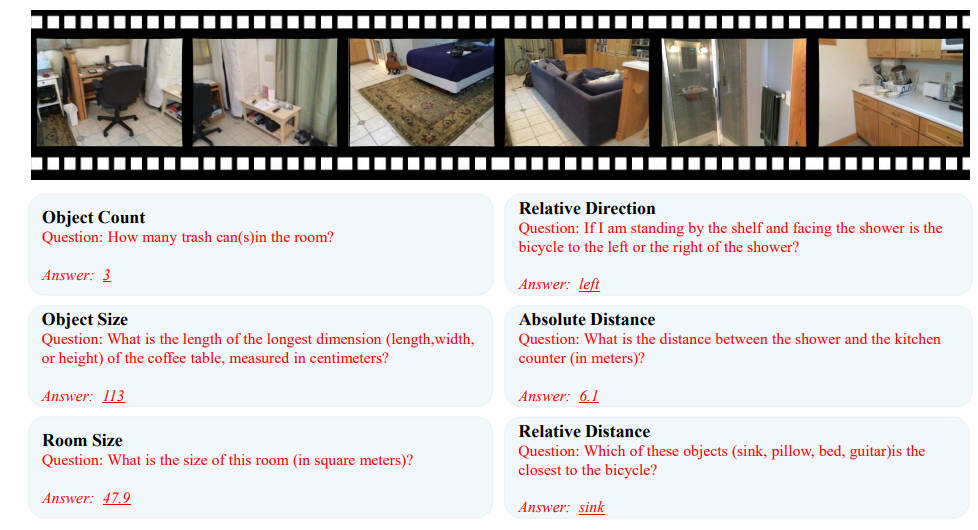
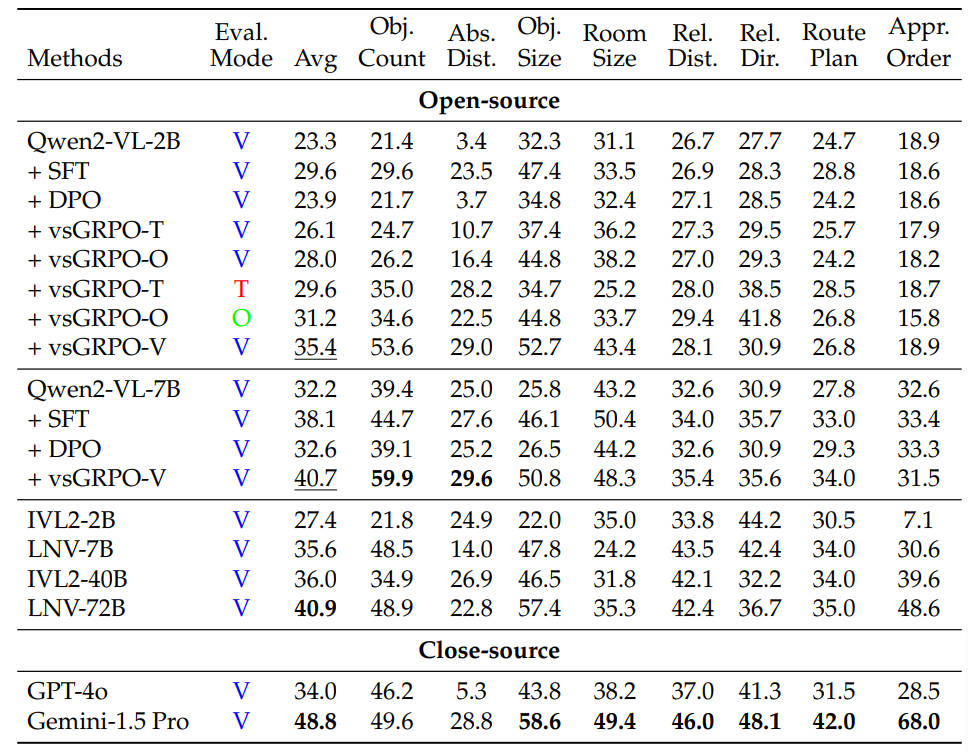

<p align="center">
<!--   <h1 align="center"></h1> -->
  <h1 align="center">Improved Visual-Spatial Reasoning via R1-Zero-Like Training</h1>
    <p align="center">
    <strong>Zhenyi Liao</strong></a>,
    <strong>Qingsong Xie</strong></a>,
    <strong>Yanhao Zhang</strong></a>,
    <strong>Zijian Kong</strong></a>,
    <strong>Haonan Lu</strong></a>,
    <strong>Zhenyu Yang</strong></a>,
    <strong>Zhijie Deng</strong></a>
  </p>
  <!-- 📖<a href="https://arxiv.org/abs/2504.00883">Paper</a> -->
  <!-- 🤗<a href="https://huggingface.co/collections/laolao77/virft-datasets-67bc271b6f2833eccc0651df">
  Datasets</a> | 🤗<a href="https://huggingface.co/papers/2503.01785">Daily Paper</a></h3> -->
<div align="center"></div>
<p align="center">

## 📅 News
- 🚀 [04/02/2025] We release our paper on <a href="https://arxiv.org/abs/2504.00883">arxiv</a>.


## 🌞 Highlights
  <p>
  <!-- 🔔 We identify that the visual-spatial reasoning capacities of small- to medium-sized Qwen2-VL models cannot be activated via Chain of Thought (CoT) prompts.  -->

  🔔 We incorporate GRPO training for improved visual-spatial reasoning, using the carefully curated <strong>VSI-100k<strong> dataset. 

  🔔 With GRPO training, our vsGRPO-2B outperforms GPT-4o, and the vsGRPO-7B demonstrates performance comparable to the best open-source model, LLaVA-Video-Next-72B.
  </p>


<!-- 
## 📹Prompting strategy
We designed three types of prompting strategies: think-mode, observe-mode, and vanilla-mode. These strategies prompt the model to think, observe first, or provide an answer directly. We evaluated Qwen2-VL-2B/7B on VSI-bench, revealing that the CoT prompting strategy does not effectively trade inference FLOPs for improved visual-spatial reasoning.

<a href="">
  
</a>
<!-- | Backbone      | Methods        | Avg  | Count | Abs. Dist. | Obj. Size | Room Size | Rel. Dist. | Rel. Dir.  | Route Plan | Appr. Order |
|---------------|----------------|------|-------|------------|-----------|-----------|------------|------------|------------|-------------|
| Qwen2-VL-2B   | Think-mode     | 22.9 | 18.4  | 4.3        | 31.5      | 17.3      | 28.3       | 22.9       | 26.2       | 16.8
| Qwen2-VL-2B   | Observe-mode   | 21.8 | 16.8  | 1.7        | 32.7      | 22.7      | 28.8       | 27.6       | 26.2       | 18.1
| Qwen2-VL-2B   | Vanilla-mode   | 23.3 | 21.4  | 3.4        | 32.3      | 31.1      | 26.7       | 27.7       | 24.7       | 18.9
| Qwen2-VL-7B   | Think-mode     | 31.3 | 44.8  | 26.1       | 25.3      | 23.4      | 34.7       | 30.9       | 32.9       | 31.5
| Qwen2-VL-7B   | Observe-mode   | 32.0 | 29.9  | 19.0       | 39.6      | 32.0      | 34.6       | 40.0       | 36.0       | 24.4
| Qwen2-VL-7B   | Vanilla-mode   | 32.2 | 39.4  | 25.0       | 25.8      | 43.2      | 32.6       | 30.9       | 27.8       | 32.6 -->
<!-- 
We illustrate one example below. More details can be found in the original paper.

<a href="">
  
</a> --> 

## 🤗 VSI-100k
To combat the data scarity, we build <strong>VSI-100k<strong>. Specifically, with the ScanNet 3D annotation information, we construct approximately 100k question-answer pairs.
<!-- <strong>We will release the original data as long as we get the permission.<strong> -->
<a href="">
  
</a>

## 🔍 Experiments
Our vsGRPO-2B outperforms GPT-4o, and the vsGRPO-7B demonstrates performance comparable to the best open-source model, LLaVA-Video-Next-72B.

<a href="">
  
</a>

<!-- ## 🛠️ Training
<!-- ```
soon
``` -->
<strong>We will release the code with the permission.<strong> -->


<!-- ## ✒️Citation
```
@article
``` -->
## 🚩 Tasks
🔒 The release of VSI-100k (will be in June 2025 for some reason). 

🔒 The release of the training codes and the evaluation (will also be in June 2025).

## 📄 License
  **Usage and License Notices**: The data and code are intended and licensed for research use only.
License: Attribution-NonCommercial 4.0 International It should abide by the policy of OpenAI: https://openai.com/policies/terms-of-use

## Acknowledgement
We sincerely thank projects <a href="https://github.com/Deep-Agent/R1-V">R1-V</a> and <a href="https://github.com/ScanNet/ScanNet">ScanNet</a>, based on which we build our project.
We also thank <a href="https://github.com/huggingface/trl">trl</a>, <a href="https://github.com/QwenLM/Qwen2.5-VL">Qwen2-VL</a>, <a href="https://github.com/vllm-project/vllm">vllm</a> for their open-source techniques.
